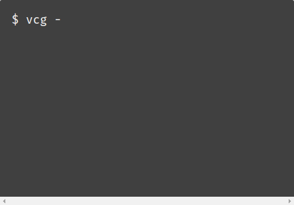

<p>
  
</p>

## vue-cli-ghpages

[](https://badge.fury.io/js/vue-cli-ghpages) [](https://github.com/jeneser/vue-cli-ghpages) [](http://isitmaintained.com/project/jeneser/vue-cli-ghpages "Percentage of issues still open") [](https://github.com/jeneser/vue-cli-ghpages/pulls) [](https://github.com/jeneser)

[](https://nodei.co/npm/vue-cli-ghpages/)

Publish to any `gh-pages` branch on GitHub. The Single-Page App **Hack** for GitHub Pages.

Quickly deploy vue app to [`github pages`](https://pages.github.com/).

Made for [`vue-cli`](https://github.com/vuejs/vue-cli) users.

Made on top of [tschaub/gh-pages](https://github.com/tschaub/gh-pages).

Inspired by [`angular-cli-ghpages`](https://github.com/angular-buch/angular-cli-ghpages) and [`spa-github-pages`](https://github.com/rafrex/spa-github-pages).


## Quick start

Quickly understand what `vue-cli-ghpages` has done.

<p>
  
</p>

## Installation

This command has the following prerequisites:

- Node.js 6.x
- Git 1.7.6 or higher
- **optional:** Vue project created via [vue-cli](https://github.com/vuejs/vue-cli)

To install the command once globally run the following:

```
$ npm install -g vue-cli-ghpages
```

## Usage

Execute `vue-cli-ghpages` in order to deploy the project with a build from `dist` folder.

**Note: you have to create the dist folder in before (e.g. npm run build)**

Usage:

```
$ npm run build
$ vue-cli-ghpages [OPTIONS]
```

there is also a shorter `vcg` command available

```
$ npm run build
$ vcg [OPTIONS]
```

**Tip:** If you want to push to `gh-pages` on the same repository with your **default credentials**,  then just enter **`vcg`** without any options.

## Options

#### --help

 * Example: `vcg --help`

Output usage information.

#### --version

 * Example: `vcg --version`

Output the version number.

#### --message

 * **[optional]**
 * Default: `Vcg: Update live demo`
 * Example: `vcg --message="Update live demo"`

The commit message, **must be wrapped in quotes**.

#### --branch

 * **[optional]**
 * Default: `gh-pages`
 * Example: `vcg --branch=other-branch`

The name of the branch you'll be pushing to.
The default uses GitHub's `gh-pages` branch,
but this can be configured to push to any branch on any remote.

#### --name & --email

 * **[optional]**
 * Default: value of `git config user.name` and `git config user.email`
 * Example: `vcg --name="Displayed Username" --email=mail@example.org`

If you are running the command in a repository without a `user.name` or `user.email` git config properties
(or on a machine **without** these global config properties),
you **must** provide user info before git allows you to commit.
In this case provide both `name` and `email` string values to identify the committer.

#### --repo

 * **[optional]**
 * Default: url of the origin remote of the current dir (assumes a git repository)
 * Example: `vcg --repo=https://example.com/other/repo.git`

By default, [**gh-pages**](https://github.com/tschaub/gh-pages) assumes that the current working directory is a git repository,
and that you want to push changes to the `origin` remote.
If instead your files are not in a git repository, or if you want to push to another repository,
you can provide the repository URL in the `repo` option.

#### --dir

 * **[optional]**
 * Default: `dist`

Directory for all published sources, relative to the project-root.
Most probably no change is required here.
This option can be used to deploy completely different folders,
which are not related at all to Vue.

#### --CNAME

 * **[optional]**
 * Default: ''
 * Example: `vcg --CNAME=example.io`

Set up a custom domain.
see GitHub Pages instructions for [setting up a custom domain](https://help.github.com/articles/quick-start-setting-up-a-custom-domain/).

#### --pre-deploy
 * **[optional]**
 * Default: `undefined`
 * Example: `vcg --pre-deploy`

Check the environment and configuration. Run through without publishing.

## FAQ

<details>
	<summary>Where can I see my deployed github pages url?</summary><br>
	Go to you repository settings, scroll down to the GitHub Pages section.
	You will see: Your site is published at https://user.github.io/project/
</details>
<details>
	<summary>My CNAME file is deleted on every publish?</summary><br>
	That's by design, the command overrides everything. But, you just need to configure it once. It will make changes based on the existing configuration(CNAME) and flag(--CNAME).
	You can also manually modify. (echo "my-domain.com" > dist/CNAME)
</details>

## Contributing

1. Fork it!
2. Create your feature branch: `git checkout -b my-new-feature`
3. Commit your changes: `git commit -am 'Add some feature'`
4. Push to the branch: `git push origin my-new-feature`
5. Submit a pull request

## Thanks

[`angular-cli-ghpages`](https://github.com/angular-buch/angular-cli-ghpages)

[`spa-github-pages`](https://github.com/rafrex/spa-github-pages)

[`gh-pages`](https://github.com/tschaub/gh-pages)

## License

[MIT](https://github.com/jeneser/vue-cli-ghpages/blob/master/LICENSE) Copyright (c) 2017 [Jeneser](https://jeneser.github.io/)
